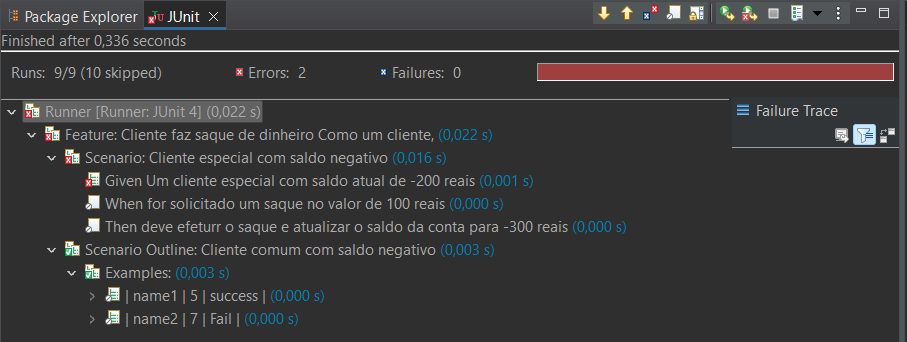
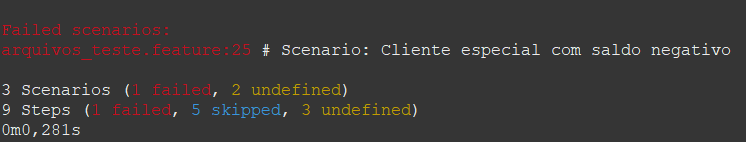

# Projeto Conta Bancária - Cucumber BDD (Behaviour-Driven Development)
Este projeto demonstra a implementação, passo a passo, da classe "Conta" utilizando o processo Behaviour-Driven Development (BDD) com Cucumber. O BDD é uma abordagem que se concentra na colaboração entre desenvolvedores, testadores e partes interessadas para garantir que o software atenda aos requisitos de negócios. Já o Cucumber, representa uma ferramenta de automação de testes e uma biblioteca que é amplamente utilizada durante as práticas de BDD (Behavior-Driven Development), permitindo que equipes de desenvolvimento e testes criem testes automatizados com base em especificações escritas em linguagem natural, verificando se o software, de fato, se comporta de acordo com essas especificações.

## Pré-requisitos
Certifique-se de ter as seguintes ferramentas instaladas em seu ambiente de desenvolvimento para que todo o passo a passo possa ser reproduzido adequadamente:

<ul>
  <li>Java JDK</li>
  <li>Maven</li>
  <li>Cucumber</li>
</ul>

## Estrutura do Projeto

- `Conta.java`: Classe responsável pela classe de Conta do projeto.
- `arquivos_teste.feature`: Arquivo de Testes do Cucumber, responsável pela realização de testes unitários para a classe `Conta`, implementando todo o processo de BDD.

## Executando o Projeto

1. Clone o repositório: `git clone https://github.com/guimagarotti/Processo-BDD-Conta.git`
2. Importe o projeto em sua IDE favorita.
3. Execute inicialmente a classe de teste `arquivos_teste.feature` para garantir que a execução do projeto funcione corretamente.
4. Posteriormente, execute a classe `Conta` para que o resultado esperado seja atingido.

## Por que o projeto é útil

<ul>
  <li><b>Documentação Automatizada:</b> os cenários BDD descrevem o comportamento esperado do sistema de uma maneira clara e legível, e essa documentação é mantida atualizada à medida que os cenários de teste são executados;</li>
  <li><b>Testes Automatizados:</b> o cucumber permite a automação dos cenários de teste escritos em Gherkin. Isso resulta em uma sequência de testes automatizada que pode ser executada repetidamente para garantir que as funcionalidades continuem a funcionar conforme esperado;</li>
  <li><b>Detecção Precoce de Problemas:</b> ao escrever cenários BDD antes da implementação, é possível identificar potenciais problemas ou ambiguidades nos requisitos antes mesmo de começar a codificar. Isso ajuda a economizar tempo e esforço corrigindo problemas mais tarde no ciclo de desenvolvimento.</li>
</ul>

## Resultados

    

Após a obtenção dos resultados, foi possível observar a Feature principal, que dizia respeito sobre a diferença na questão de saque para clientes Especiais e Comuns.

No cenário 1, um cliente do tipo Especial fazia a solicitação de saque e, diferentemente do cliente de tipo Comum, ele tinha acesso para realizar essa transferência, mesmo que seu saldo já estivesse negativo, contrariando o outro caso, que não poderia realizar o saque se não houvesse um saldo maior ou igual ao valor do saque.

No cenário 2, um cliente do tipo Comum fazia a solicitação de saque e, diferentemente do cliente de tipo Especial, tinha sua solicitação negada, visto que já possuia um saldo na conta negativo, impossibilitando a transferência visto que seu saldo era insuficiente para que tal possibilidade se tornasse viável.

  

Observando a conclusão dos cenários com falha, é possível concluir que o cenário "Cliente especial com saldo negativo" se dividiu em 3 cenários principais, sendo 1 com falha e 2 com resultados não definidos, contendo 9 etapas no decorrer de todo o processo, sendo 1 com falha, 5 pulados e 3 não definidos. Sendo assim, foi possivel visualizar também, via console, todos os métodos que falharam e que necessitavam de novas implementações. Além disso, códigos de erro que identificavam e facilitavam a correção de possíveis melhorias ao software, melhorando a codificação, já que possibilita uma codificação feita sob demanda, desde que não hajam novos erros.

